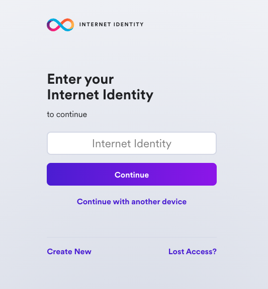
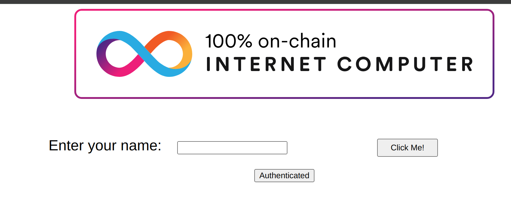

---
keywords:
  [intermediate, tutorial, developer journey, identities, authentication]
---

# 4. Identities and authentication

When developing on the Internet Computer, there are several types of identities and methods of authentication that you'll encounter.
These three types of authentication are used for interacting with canisters and cycles, but what about interacting with applications or websites built on ICP? For that, end-users can use **Internet Identity**, ICP's native form of digital identity that can be used to authenticate with apps, such as the NNS dashboard, without having to manage a username or password. Instead, Internet Identity uses a cryptographic key pair that's stored in your local computer's hardware. Through this simple and flexible authentication method, developers can provide end-users with a frictionless way to authenticate and use their application.

## Types of identity

First, let's clearly define the difference between the different types of identity and authentication on the Internet Computer. As you've already covered some of these in previous modules, some of this will be a review.

- **Developer identity**: created using `dfx`. It contains a private/public key pair, and has a `principal` data type derived from the public key. It can be compared to a Bitcoin or Ethereum wallet address.

- **Principals**: generic identifiers that are used for users, canisters, and potentially other future concepts. There is intentionally no way to tell canister principal IDs and user principal IDs apart. You can learn more in the IC [specification](https://internetcomputer.org/docs/current/references/ic-interface-spec#principal).

- **Principal identifiers**: principals associated with a user principal ID. Principal identifiers are related to account identifiers, but use a different format. Each principal identity can control multiple accounts in the ICP (and other) ledgers.

- **Account identifier**: the identifier associated with your ICP ledger account, as specified in the [ledger](https://internetcomputer.org/docs/current/developer-docs/defi/icp-tokens/overview) specification.

- **Wallets**: used to store forms of currency or other assets, such as cycles, ICP, or NFTs. Developers primarily use the cycles ledger to send cycles to and from canisters.

- **Internet Identity**: ICP's native authentication service. Internet Identity doesn't use usernames and passwords; instead it uses a **passkey** that is stored in your local device's hardware.

In this guide, you'll primarily look at how to use Internet Identity, as the other forms of identity have been covered in previous modules.

## Internet Identity

On traditional, Web2 websites and applications, many of them have the option for you to 'Sign in with Google', which allows you to authenticate with the application using your username and password credentials for Google, preventing you from having to make a new username and password for that application.

On the Internet Computer, a native form of identity is used for authentication, called the Internet Identity.

Internet Identity allows users to register and authenticate with websites or applications without using a username and password. Instead, users can use a **passkey**, which is a unique cryptographic public/private key pair that is stored in the secure hardware chip of your computer or phone. This allows you to authenticate your Internet Identity using methods that unlock your device, such as TouchID, FaceID, or another method.

A different identity is issued for each app a user authenticates to and cannot be linked back to the user. With Internet identity, no personal data is stared with dapps or the Internet Identity application itself, and no software needs to be downloaded and installed.

### Internet Identity architecture

Internet Identity uses an implementation of the WebAuthn API that runs within a single canister that serves both the II frontend application code and handles the requests that are sent by the frontend code. The app's authentication service issues 'delegations' on the user's behalf, which are signed with private cryptographic material created by the WebAuth API that is owned by the user. This private material never leaves the user's device, as it is stored in the local hardware securely. Then, the II frontend uses the WebAuthn API to sign the delegation with the cryptographic material.

For more details on how the Internet Identity architecture works, please refer to the [official Internet Identity Specification](https://internetcomputer.org/docs/current/references/ic-interface).

### What is a passkey?

A **passkey** is a public/private key pair that is stored in your local device's secure hardware chip. This passkey value is a more secure and convenient alternative to using a username/password combination, and it enables users to sign into dapps by using biometric authentication options, such as FaceID or TouchID.

## Creating an Internet Identity

To create an Internet Identity, navigate to the II frontend URL: https://identity.ic0.app/

Select 'Create New' from the UI.



Next, select 'Create Passkey'.


When prompted, choose how to create your passkey, either on your current device or you can use another device.


Then, enter the CAPTCHA to continue.


Your Internet Identity has been created! It'll be shown on the screen, and it is recommended that you write it down in a safe location to save it.

This number is your Internet Identity. With this number and your passkey, you will be able to create and securely connect to Internet Computer dapps. If you lose this number, you will lose any accounts that were created with it. This number is not secret, but is unique to you.

Once you save it, select the 'I saved it, continue' button.


Then, you can connect your Internet Identity to dapps, shown in the Dapps Explorer:


If you scroll down, you will see an option to add another passkey, and you will see options to enable recovery methods. **It is highly recommended to enable the recovery methods so that you can recover your Internet Identity if the hardware passkey is ever lost.**


## Integrating Internet Identity into your dapp

Now let's look at a simple example on how to integrate Internet Identity into the frontend of your dapp.

### Prerequisites

Before you start, verify that you have set up your developer environment according to the instructions in [3. Developer environment setup](/docs/developer-journey/level-0/3-dev-env.mdx).

### Creating a new project

To get started, open a terminal window, navigate into your working directory (`developer_journey`), then use the commands:

```bash
dfx start --clean --background
git clone https://github.com/Jonath-z/ICP-workshop
cd internet_identity_
npm install
```

### Importing the auth-client package

Next, let's take a look at the assets for the frontend of the application. For this guide you'll stick with using React. If you take a look at the `/src/internet_identity_frontend/src/App.jsx` file, you can see that you need to import the `AuthClient` from `@dfinity/auth-client`:

```typescript
import { AuthClient } from "@dfinity/auth-client";
```

Then, you define two states, `greetings` and `isAuthenticated`, which will store the greeting message and the track whether the user is authenticated or not.

```typescript
const [greeting, setGreeting] = useState("");
const [isAuthenticated, setIsAuthenticated] = useState(false);
```

Next, you will use the `useEffect` hook to perform a side effect (authentication setup) when the component mounts. It creates an instance of `AuthClient`, stores it in the window object, and checks if the user is already authenticated.

```typescript
useEffect(() => {
  (async () => {
    const authClient = await AuthClient.create();
    window.authClient = authClient;
    setIsAuthenticated(await window.authClient?.isAuthenticated());
  })();
}, []);
```

Now, create `auth` function that will be called when the **Authenticate yourself** button is clicked. It uses the login method of the `AuthClient` to initiate the authentication process. The identity provider URL is determined based on the environment (DFX_NETWORK) and passed to the login method.

```typescript
async function auth() {
  await window.authClient?.login({
    identityProvider:
      process.env.DFX_NETWORK === "ic"
        ? "https://identity.ic0.app/#authorize"
        : `http://rdmx6-jaaaa-aaaaa-aaadq-cai.localhost:4943/`,
  });
}
```

Lastly, you will return JSX representing the UI of the component. It includes an image, a form to input a name, a button to submit the form, a button to authenticate, and a section to display the greeting message.

```typescript
return (
  <main>
    
    <br />
    <br />
    <form action="#" onSubmit={handleSubmit}>
      <label htmlFor="name">Enter your name: &nbsp;</label>
      <input id="name" alt="Name" type="text" />
      <button type="submit">Click Me!</button>
    </form>
    <button
      onClick={auth}
      style={{
        display: "flex",
        justifyContent: "center",
        alignItems: "center",
        margin: "10px auto",
      }}
    >
      {isAuthenticated ? "Authenticated" : "Authenticate yourself"}
    </button>
    <section id="greeting">{greeting}</section>
  </main>
);
```

### Pulling the Internet Identity canister

Now, if you noticed you didn't create a canister for the Internet Identity service. That's because, if you take a look at this project's `dfx.json` file, you **pull** the Internet Identity canister from the mainnet.

```json
{
  "canisters": {
    "internet_identity_backend": {
      "build": "npx azle internet_identity_backend",
      "candid": "src/internet_identity_backend/internet_identity_backend.did",
      "gzip": true,
      "main": "src/internet_identity_backend/src/index.ts",
      "type": "custom",
      "wasm": ".azle/internet_identity_backend/internet_identity_backend.wasm"
    },
    "internet-identity": {
      "type": "pull",
      "id": "rdmx6-jaaaa-aaaaa-aaadq-cai"
    },
    "internet_identity_frontend": {
      "dependencies": ["internet_identity_backend", "internet-identity"],
      "source": ["src/internet_identity_frontend/dist"],
      "type": "assets",
      "workspace": "internet_identity_frontend"
    }
  },
  "defaults": {
    "build": {
      "args": "",
      "packtool": ""
    }
  },
  "output_env_file": ".env",
  "version": 1
}
```

Now let's deploy this project locally. First, pull the II canister using `dfx deps`, then deploy the project:

```bash
dfx deps pull
```

This command will return output such as:

```
$ Fetching dependencies of canister rdmx6-jaaaa-aaaaa-aaadq-cai...
Found 1 dependencies:
rdmx6-jaaaa-aaaaa-aaadq-cai
Pulling canister rdmx6-jaaaa-aaaaa-aaadq-cai...
WARN: Canister rdmx6-jaaaa-aaaaa-aaadq-cai has different hash between on chain and download.
on chain: a3b50a3b35c487b9e5e9cd0174845d83fe15d5bb5d78e507647ed2272777568f
download: 197d0423178a6ae2785c924b962648e2b47e6ccb2a25e98d9220d9f3ce5eebf7
```

Open the `deps/pull.json` file and modify the `wasm_hash` value with the `download` value from the previous output:

```
{
  "canisters": {
    "rdmx6-jaaaa-aaaaa-aaadq-cai": {
      "name": "ii",
      "wasm_hash": "197d0423178a6ae2785c924b962648e2b47e6ccb2a25e98d9220d9f3ce5eebf7",
      "init_guide": "Use '(null)' for sensible defaults. See the candid interface for more details.",
      "init_arg": null,
      "candid_args": "(opt InternetIdentityInit)",
      "gzip": true
    }
  }
}
```

Then, you need to initialize the canister. By running the `dfx deps init` command, it'll show that our II canister requires an init argument:

```bash
dfx deps init
```

```bash
WARN: The following canister(s) require an init argument. Please run `dfx deps init <NAME/PRINCIPAL>` to set them individually:
rdmx6-jaaaa-aaaaa-aaadq-cai (internet_identity)
```

This output shows you that the Internet Identity canister requires an init argument, but doesn't include what that init argument is. For more information, run the command `dfx deps init rdmx6-jaaaa-aaaaa-aaadq-cai`, which will provide an error message that includes more information:

```bash
Error: Canister rdmx6-jaaaa-aaaaa-aaadq-cai (internet_identity) requires an init argument. The following info might be helpful:
init => Use '(null)' for sensible defaults. See the candid interface for more details.
candid:args => (opt InternetIdentityInit)
```

From this error message, you can see that the `(null)` value can be passed to the init command to use the defaults. To do so, run the command:

```bash
dfx deps init rdmx6-jaaaa-aaaaa-aaadq-cai --argument null
```

Then, you can deploy the II canister and the other canisters in the project with the command:

```bash
dfx deps deploy
dfx deploy
```

Then, start the local development server:

```bash
npm start
```

This command will output the following:

```bash
  VITE v4.3.6  ready in 137 ms

  ➜  Local:   http://127.0.0.1:5173/
  ➜  Network: use --host to expose
  ➜  press h to show help
```

### Interacting with the integration

Navigate to the 'Local' URL in your web browser. You will see the frontend of the app:


Then, select 'Log in'. You'll be redirected to the II frontend. Since you're running this locally, note that this is for **testing** only, and you should not use your production II. It is recommended to create another for local testing purposes. To do so, follow the on-screen steps that you walked through previously.


Once you are redirected back to the frontend of the app, the button title `Authenticate yourself` should change into `Authenticated`.



You've now integrated Internet Identity into a local dapp! That'll wrap things up for this module.

## Need help?

Did you get stuck somewhere in this tutorial, or feel like you need additional help understanding some of the concepts? The ICP community has several resources
available for developers, like working groups and bootcamps, along with our
Discord community, forum, and events such as hackathons. Here are a few to check
out:

- [Developer Discord community](https://discord.com/invite/cA7y6ezyE2), which is
  a large chatroom for ICP developers to ask questions, get help, or chat with
  other developers asynchronously via text chat.

- [Developer journey forum discussion](https://forum.dfinity.org/t/developer-journey-feedback-and-discussion/23893).

- [Developer tooling working group](https://www.google.com/calendar/event?eid=MHY0cjBubmlnYXY1cTkzZzVzcmozb3ZjZm5fMjAyMzEwMDVUMTcwMDAwWiBjX2Nnb2VxOTE3cnBlYXA3dnNlM2lzMWhsMzEwQGc&ctz=Europe/Zurich).

- [Weekly developer office hours](https://discord.gg/4a7SZzRk?event=1164114241893187655)
  to ask questions, get clarification, and chat with other developers live via
  voice chat. This is hosted on our
  [developer Discord](https://discord.com/invite/cA7y6ezyE2) group.

- Submit your feedback to the [ICP Developer feedback board](http://dx.internetcomputer.org).
